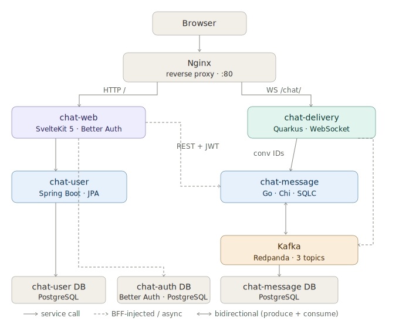

# chat-demo

A working polyglot chat system demonstrating how **Spring Boot, Go, Quarkus, and SvelteKit** integrate in a single distributed application — JWT propagation across services, Kafka-backed real-time fan-out, a BFF pattern that owns auth transparently, and a WebSocket delivery layer designed with horizontal K8s scaling in mind.

This is not a production blueprint and it is not a "build a chat app in 30 minutes" tutorial. It is a practical, running reference for developers who want to see multiple runtimes and protocols cooperating at a system level — and who want something they can actually clone, run, and dig into.

> gRPC for intra-service calls is planned as the next layer. REST stubs for those endpoints are already in place.

---

## Architecture



**Send path:** Browser → WS → `chat-delivery` → Kafka `chat.messages` → (a) every `chat-delivery` instance fans out to connected participants on that node; (b) `chat-message` consumes the same topic and persists to Postgres.

**Participant events:** When a user is added to or removed from a group, `chat-message` publishes to `chat.participants.created` / `chat.participants.removed`. Any `chat-delivery` instance that has the affected user connected updates their in-memory group membership immediately — no reconnect required.

**Auth → chat bridge:** On registration, Better Auth fires a `databaseHooks.user.create.after` hook that calls `chat-user-service` to provision the chat profile. The same UUID (`useruuid`) flows through Better Auth's session, all JWT `sub` claims, Kafka messages, and database foreign keys across every service.

---

## Design decisions worth exploring

These are the parts where the integration work is non-obvious and where the code is most worth reading.

**JWT propagation across services.** The BFF (`chat-web`) signs service tokens with a shared HMAC-SHA256 secret. `chat-delivery-service` receives a user's inbound token (audience: `chat-delivery-service`) but cannot forward it to `chat-message-service` — wrong audience. Instead, `ServiceTokenFactory` mints a new short-lived token (30s TTL) preserving the user's `sub` and setting the correct `iss`/`aud`. See `client/ServiceTokenFactory.java` and `client/ServiceAuthFilter.java` in `chat-delivery-service`.

**BFF transparent JWT injection.** `hooks.server.ts` overrides `event.fetch` with a version that inspects the URL against a service map and injects `Authorization: Bearer <token>` before the request leaves the server. Every `+page.server.ts` calls `fetch()` normally — none of them handle auth. See `src/hooks.server.ts` in `chat-web`.

**WebSocket JWT handshake.** Browser WebSocket upgrades don't reliably support custom headers. The solution encodes the token as a subprotocol string that Quarkus unpacks into the `Authorization` header before JWT validation. See `src/lib/store/ws.ts` (client) and `application.properties` (server config).

**Kafka fan-out for horizontal scaling.** Each `chat-delivery` pod gets a unique consumer group ID (`chat-delivery-service-${quarkus.uuid}`), so every pod receives every `chat.messages` event and fans out to its own connected clients. No sticky sessions, no shared in-memory state, no Redis. See `ChatConsumer.java` and `application.properties` in `chat-delivery-service`.

**Cursor-based message pagination with a visibility guard.** Message queries use keyset pagination (`id < cursor`) rather than `OFFSET`. A `joined_at` guard in the SQL ensures users never see messages sent before they joined the conversation. See `GetMessagesByConversationCursor` in `chat-message-service/internal/db/queries/messages.sql`.

**Private conversation deduplication.** Creating a private conversation between two users is wrapped in a transaction that checks for an existing one first. The check uses `IN (uuid1, uuid2) GROUP BY conversation_id HAVING COUNT(*) = 2` — a clean way to find a conversation where exactly both users are participants. See `conversation_repo_sqlc.go` in `chat-message-service`.

---

## Repo layout

This repository uses **Git submodules**. Each directory is a standalone service repo with its own README.

| Directory | Stack | Role |
|---|---|---|
| `chat-web` | SvelteKit 5, Better Auth | UI + BFF; issues JWTs, proxies all API calls |
| `chat-user-service` | Spring Boot 3, JPA | Chat user profile store |
| `chat-message-service` | Go, Chi, SQLC | Conversations, participants, message history |
| `chat-delivery-service` | Quarkus, SmallRye | WebSocket gateway + Kafka fan-out |
| `chat-infra` | Docker Compose, Nginx, Redpanda | Local infrastructure |

---

## Quick start

Prerequisites: Docker and Docker Compose.

```bash
git clone --recurse-submodules <repo-url>
cd chat-demo

# build all images
./docker-build-all.sh

# start the full stack
# (waits for Postgres and Kafka health before starting dependent services)
./compose-up.sh

# open in browser
open http://localhost

# tear down
./compose-down.sh
```

The startup script polls `pg_isready` and `rpk cluster health` before bringing up dependent services, so cold-start ordering is handled automatically.

---

## Kafka topics

| Topic | Producer | Consumer(s) |
|---|---|---|
| `chat.messages` | chat-delivery | chat-delivery (fan-out), chat-message (persist) |
| `chat.participants.created` | chat-message | chat-delivery (update group membership) |
| `chat.participants.removed` | chat-message | chat-delivery (update group membership) |

---

## Shared configuration

All services share a single `JWT_SECRET` (HMAC-SHA256). The BFF mints and signs tokens; backend services verify them as OAuth2 resource servers. Each service expects a specific `aud` claim — see individual service READMEs for details.

| Variable | Used by |
|---|---|
| `JWT_SECRET` | all services |
| `KAFKA_BOOTSTRAP` | chat-delivery, chat-message |
| `DATABASE_URL` | per-service (separate DBs on a shared Postgres instance) |

---

## Port map (local dev, behind Nginx on :80)

| Service | Host port |
|---|---|
| Nginx (entry point) | 80 |
| chat-web | 3000 |
| chat-delivery-service | 8180 |
| chat-user-service | 8380 |
| chat-message-service | 8080 |
| PostgreSQL | 5432 |
| Kafka internal | 9092 |
| Kafka external (tooling) | 19092 |

---

## What's not here

- No test coverage. This is a demo, not a production codebase.
- gRPC is scaffolded (`internal/grpc/` in `chat-message-service`, `user.proto` defined) but not yet implemented. The `GET /conversations/ids` REST endpoint is the current stand-in for intra-cluster calls.
- Spring Integration dependencies are declared in `chat-user-service` but dormant — scaffolding for a planned `UserCreated` Kafka event.
- Some `TODO` and `REVISIT` comments are intentionally left in the code — they mark known evolution points and are worth reading.
